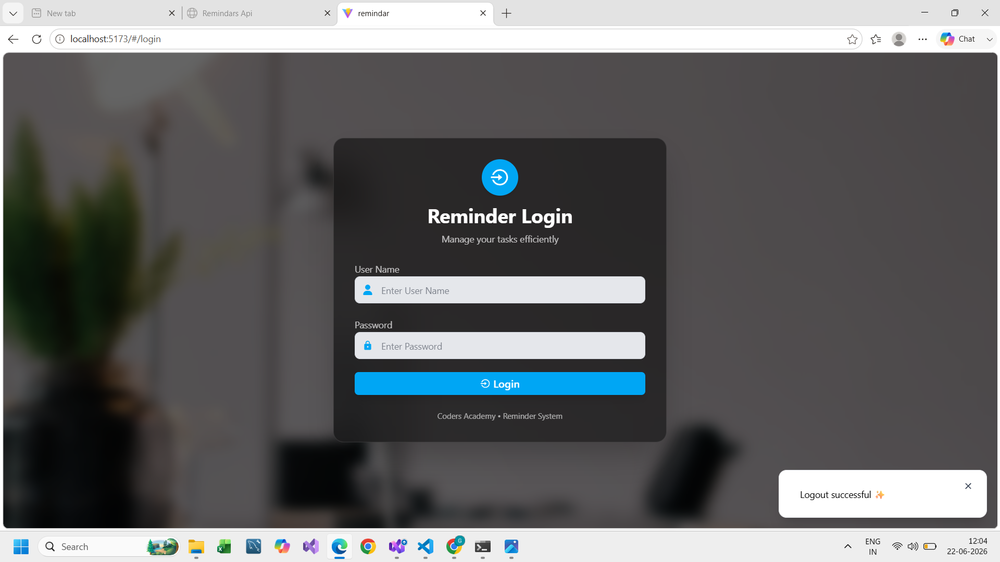
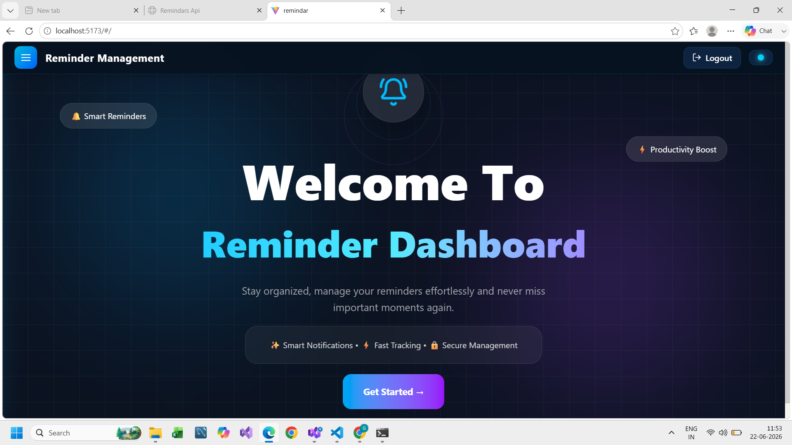
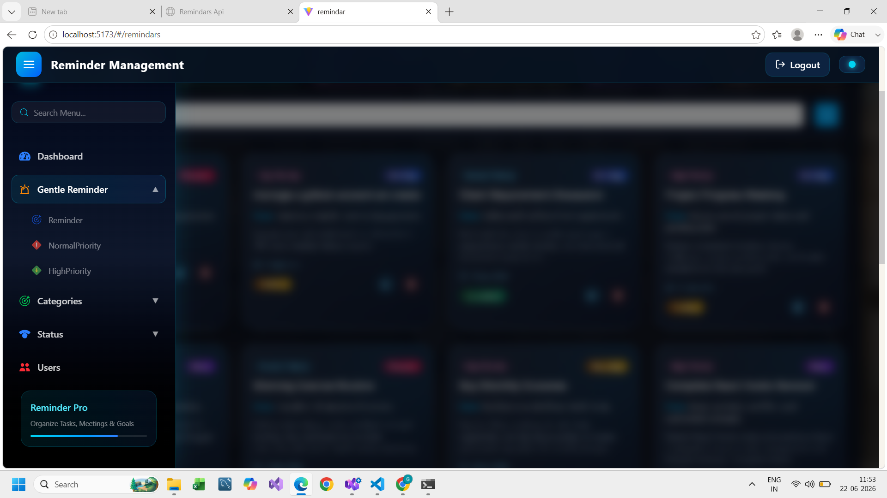
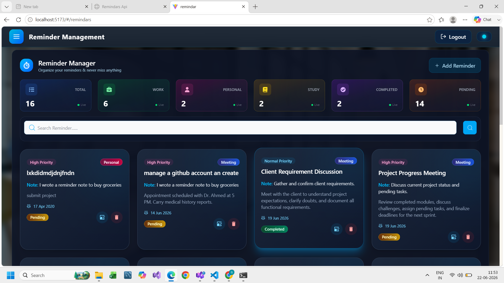
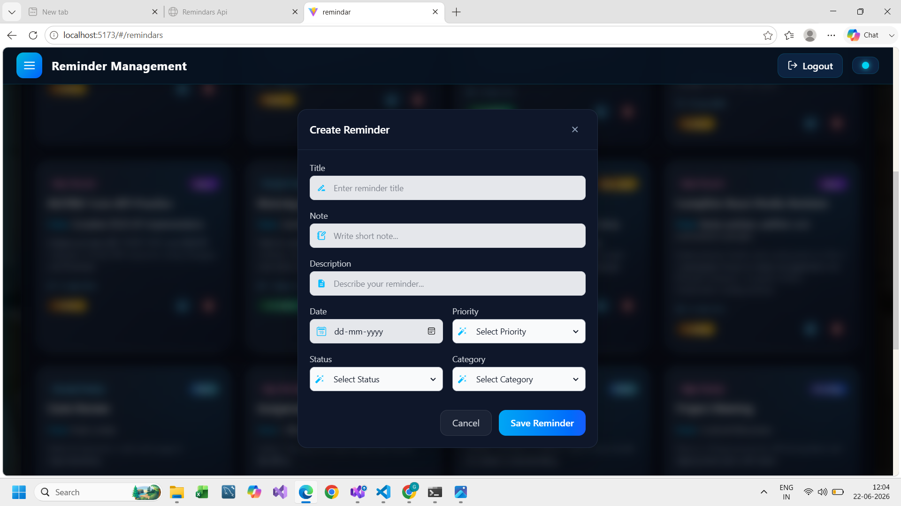
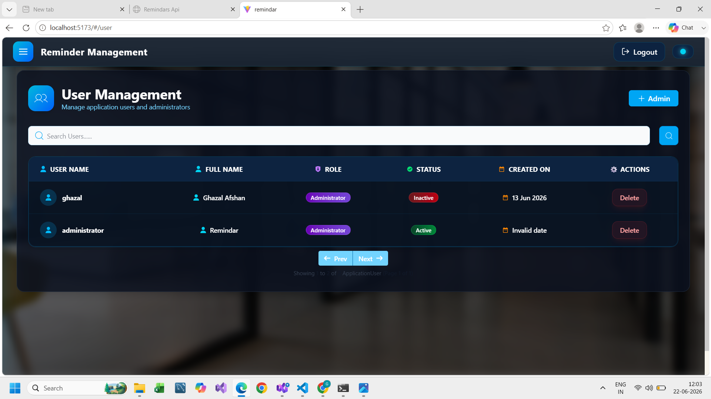
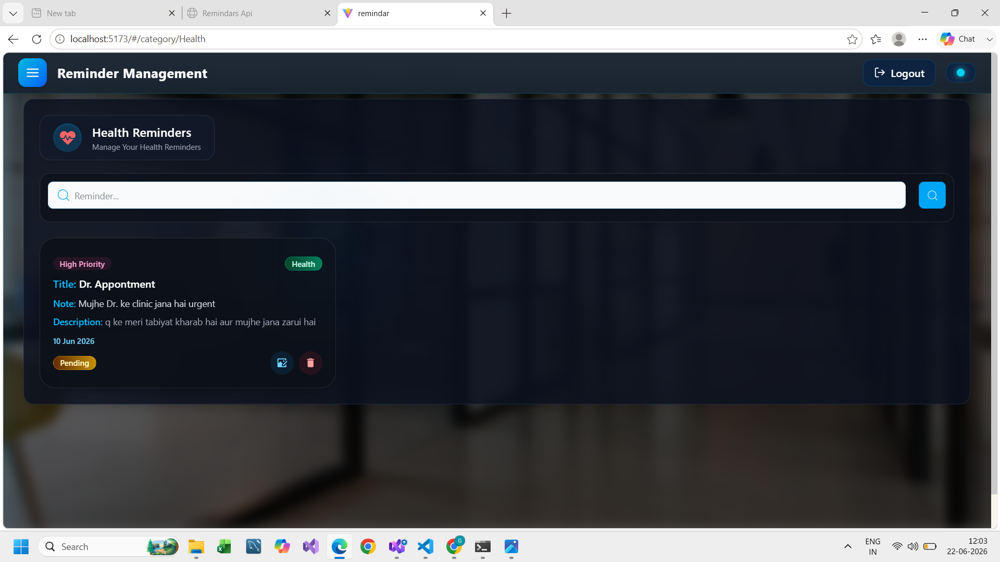
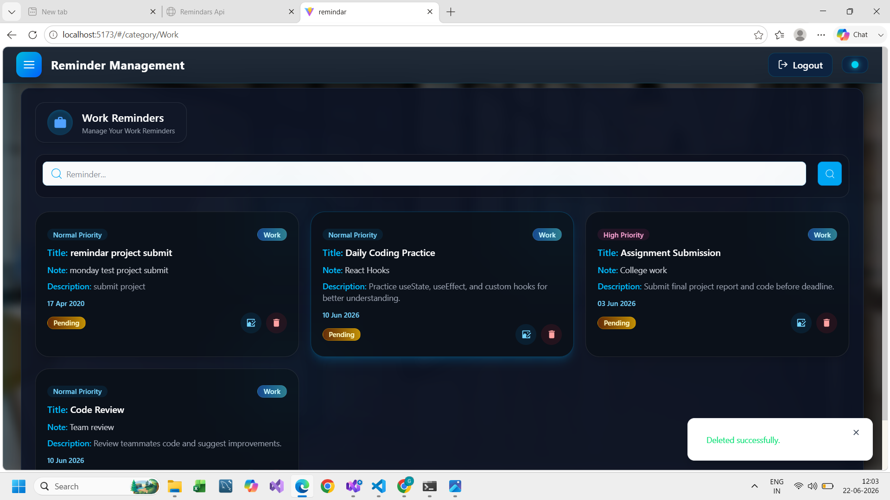
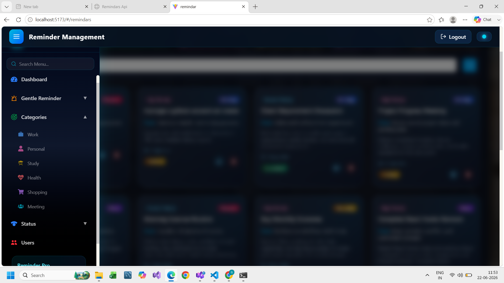
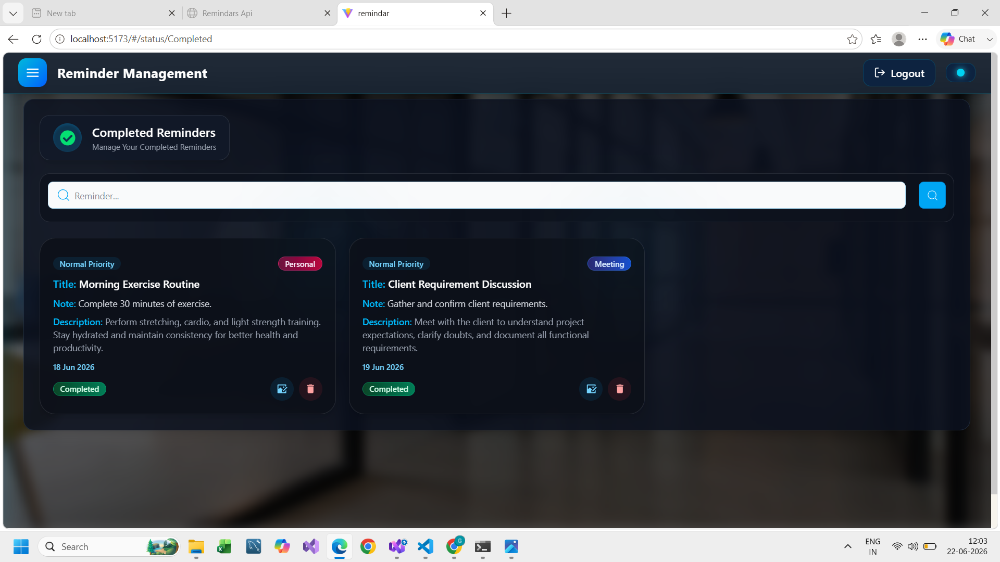

# Reminder Management System

A modern full-stack Reminder Management System developed using React.js, ASP.NET Core Web API, Class Library Architecture, Entity Framework Core, and MySQL.

The application helps users create, manage, organize, and track reminders efficiently through a secure and user-friendly interface.

---

## Features

### Authentication & Security
- JWT Authentication
- Secure Login System
- Protected Routes
- Role-Based Authorization
- User Session Management

### Reminder Management
- Add Reminder
- Update Reminder
- Delete Reminder
- View Reminder Details
- Search Reminders

### Categories
- Work
- Personal
- Study
- Health
- Shopping
- Meeting

### Status Management
- Pending
- Completed
- Cancelled

### Priority Management
- High Priority Reminders
- Normal Priority Reminders

### User Management
- Add Users
- Manage Users
- Administrator Access

### UI Features
- Modern Dark Theme
- Responsive Sidebar Navigation
- Dashboard Overview
- Glassmorphism Design
- Interactive Cards
- Toast Notifications

---

## Technology Stack

### Frontend
- React.js
- Vite
- Tailwind CSS
- Axios
- React Router DOM
- React Icons
- State Management

### Backend
- ASP.NET Core Web API
- Entity Framework Core
- JWT Authentication
- Repository Pattern
- Dependency Injection

### Class Library Architecture
- Remindars.Api
- Remindars.Services
- Remindars.Repository
- Remindars.Models
- Remindars.ViewModel
- Remindars.Enum

### Database
- MySQL

---

## Project Screenshots

### Login Page



### Dashboard



### Sidebar Navigation



### All Reminders



### Add Reminder



### User Management



### Health Category



### Work Category



### Reminder Sections



### Completed Reminders



---

## Installation

### Frontend

```bash
npm install
npm run dev
```

### Backend

```bash
dotnet restore
dotnet run
```

### Database

Configure the MySQL connection string in:

```json
appsettings.json
```

---

## Future Improvements

- Email Notifications
- Calendar Integration
- Reminder Scheduling
- Cloud Deployment
- Mobile Application
- Push Notifications

---

## Author

**Ghazal Afshan**